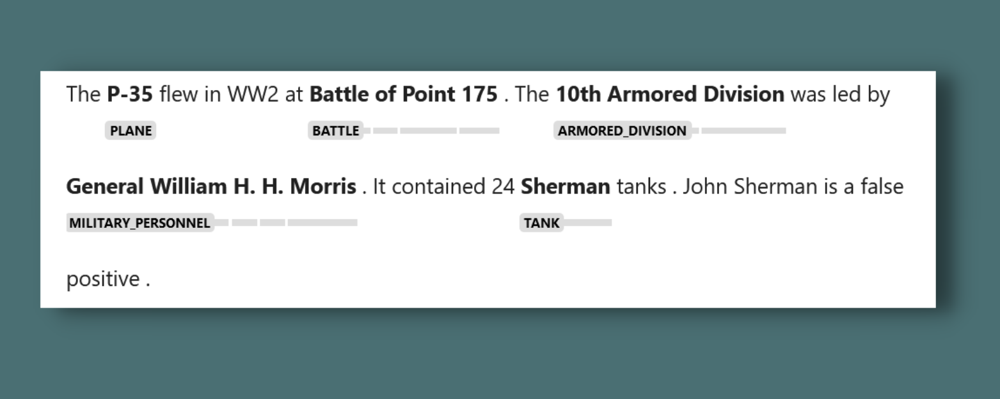

WW2 spaCy is a pipeline for processing primary and secondary sources for World War 2. The pipeline is designed to not rely on machine learning so that it can remain highly modular, meaning a user can take a specific pipe and attach it to their own pipeline without issue.

The pipeline is a SpanRuler that is used to identify and classify different military units and ships in the United States military.

In order to disambiguate certain entities (e.g. 'the 1st'), a custom spaCy component (clean_spans) passes over each span and if there is ambiguity with a set of spans priority is given to the longest span. If, however, spans are of equal length, no steps are taken to resolve the spans. This allows the user to disambiguate for themselves.

Each data file can be found under 'assets'. The first line of each .txt file is the source(s) for the data.

# Install

```python
pip install en_ww2spacy
```

# Usage
```python
import spacy
from spacy import displacy

nlp = spacy.load("en_ww2spacy")

text = """The P-35 flew in WW2 at Battle of Point 175.
The 10th Armored Division was led by General William H. H. Morris.
It contained Sherman tanks. John Sherman is a false positive."""

doc = nlp(text)
displacy.render(doc, style="span", jupyter=True, options = {"spans_key": "ruler"})
```

